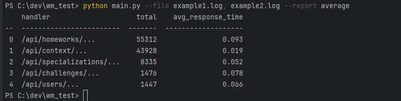
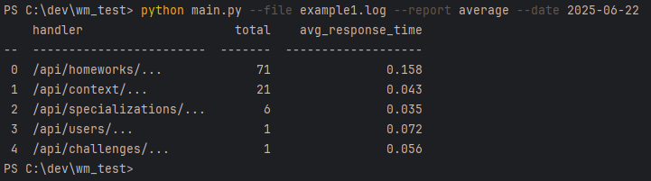

# Скрипт для обработки логов

Примеры работы:

* В --file можно отправлять несколько файлов

* Можно использовать --date для фильтрации по дате

* Есть тесты. Из главной директории:
> pytest

#### Cтэк
> tabulate, black, pytest